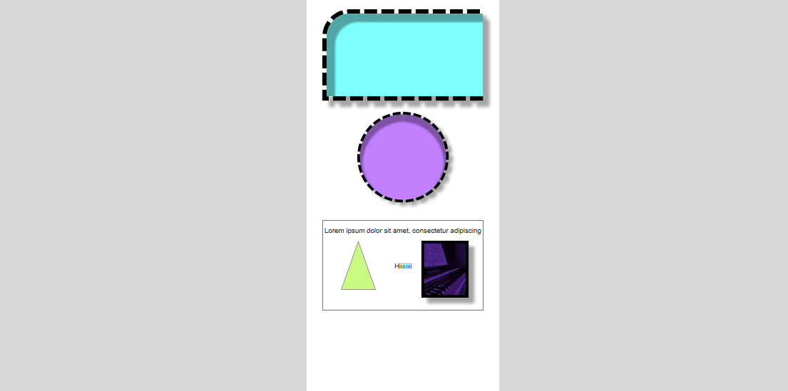

# Axure Practical Projects

This repository contains two practical exercises created using **Axure RP**, showcasing different UI elements and interactions.

## Project Overview

### 1. Practical 1
- Includes a **rounded rectangle** with a dashed black border.
- A **circular element** with a dashed outline.
- Elements feature **shadow effects** for a 3D appearance.

### 2. Practical 2
- Contains **text, a triangle shape, and an image**.
- Demonstrates **basic UI composition and layouting**.
- Showcases **different colors and alignments**.

## Outputs
### Practical 1

### Practical 2
https://github.com/user-attachments/assets/eaf94867-ec7f-4968-a05f-0d308ba0634c

## Files Included
- `Output.mp4` – A recorded demonstration of the interactions.
- `Output1.png` – A preview image of the practical work.
- Axure source files (**if applicable**).